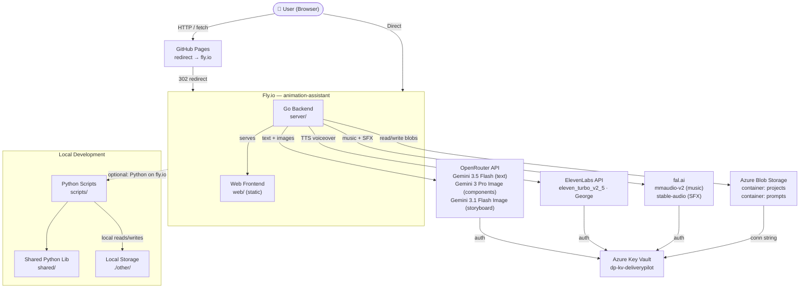

# Architecture — Animation Assistant

## System Overview



## Core Components

| Component | Location | Role |
|-----------|----------|------|
| **Go Backend** | `server/` | HTTP server, REST API, AI orchestration, file serving, storage interface. Holds all secrets. |
| **Python Scripts** | `scripts/` | Local CLI generation (script, components, audio, storyboard) triggered by AI agent. Uses shared Python helpers. |
| **Shared Python** | `shared/` | Cross-cutting helpers (config, acts, OpenRouter client, ElevenLabs client, storage, audio, storyboard) |
| **Web Frontend** | `web/` | Static HTML pages + CSS + JS. Shared shell (top nav, footer, debug bar) on every page. |

## Generation Pipeline

```
Outline ──→ Script ──→ Components ──→ Audio ──→ Storyboard
 (3-act)     (per act)   (typed imgs)  (TTS+music+SFX) (scenes)
```

Each project follows this fixed order. Acts are independent — you can generate/regenerate any single act without touching the others.

## Data Flow

1. User creates a project via the web UI (Q&A → project creation).
2. **Outline** → 3-act narrative summary via OpenRouter (Gemini).
3. **Script** → Full script per act, with beats and voiceover text.
4. **Components** → Typed images (background, lower-third, speech-bubble, etc.) generated per act via OpenRouter image models.
5. **Audio** → Three layers per act: voiceover (ElevenLabs), music (fal.ai), SFX (fal.ai).
6. **Storyboard** → Scene-by-scene plan from scripts + components via OpenRouter. 4-frame infographic PNG generated.
7. All data persists to **Azure Blob Storage** (`projects` container) or locally (`./other`).
8. All prompts saved to audit trail (`prompts` container).
